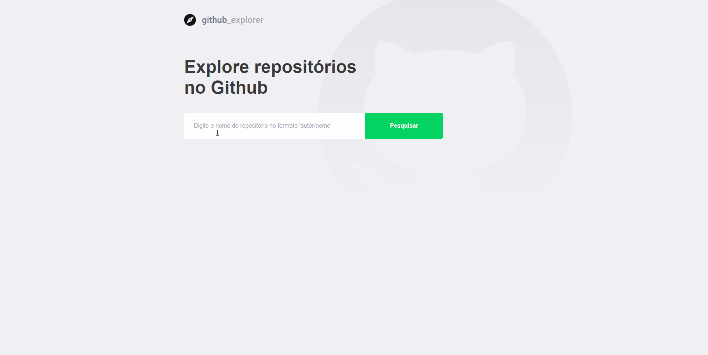

<br/>

<p align="center">
  
</p>

# About

This project is a simple project made together with rocketseat's gostack bootcamp, the main objective is to take some repos from github and show it's issues.

# Getting Started

* For this project I used [yarn](https://yarnpkg.com/getting-started) as my packet manager.

After cloning this repo, you shall go to it's folder and execute:

```bash
yarn #it will install all packages that you need
yarn start #this will execute the server and open it in your main browser
```

And that's all, this project don't use ambient variables.
